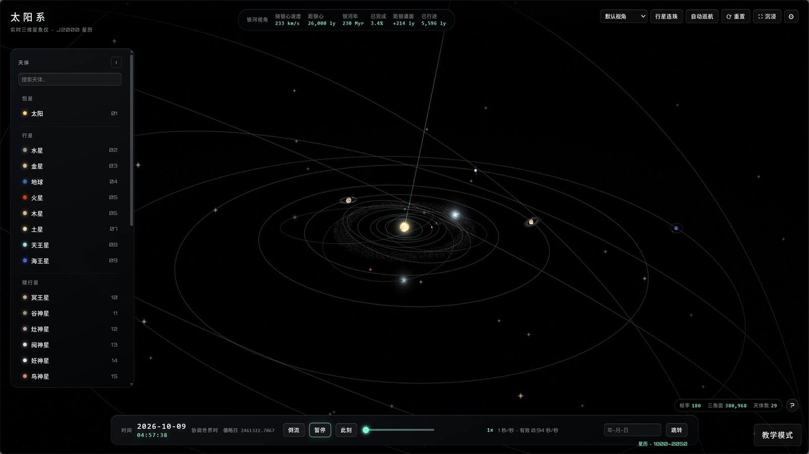

<div align="center">

# SOLAR SYSTEM · 太阳系 3D 展示

一个开箱即用的单页 3D 太阳系：八行星使用 VSOP87 J2000 要素星历、太阳系整体绕银心公转、科幻黑白 HUD、中英双语，全部资源本地化（**运行时不访问外网**）。

[](https://github.com/Yiyazadxr/SolarSystemModel/stargazers)
[](./LICENSE)
[](https://threejs.org)
[-brightgreen?style=flat-square)](#运行)
[](#运行)
[](#技术栈)

[提交 Issue](https://github.com/Yiyazadxr/SolarSystemModel/issues) · [许可](#许可)

<p align="center">
  
</p>

</div>

---

## 功能特性

- **真实天体** 🪐 — 太阳、八大行星、冥王星、11 颗主要卫星、小行星带、柯伊伯带与 1P/Halley 彗星；八行星用 VSOP87 要素级数（地球轨道为地月质心），其他天体沿用 JPL 近似根数
- **程序化渲染** ☀️ — 太阳米粒组织 / 临边昏暗 / 黑子 / 日冕，行星凹凸、纬向条纹、大红斑、菲涅尔大气辉光、日落色、环影与日月食投影，全部手写 GLSL
- **银河公转与拖尾** 🌌 — 太阳系沿**真实倾角 60.2°** 的银道面绕银心公转（233 km/s，一个银河年约 50 分钟）；太阳**实际走过**的银心轨迹（含进动与振荡）任何机位**始终显示**、随距离提亮
- **显示比例两档** 📏 — **压缩示意**（默认，便于整体观察）与**弱压缩示意**（更接近真实）可切换，只改距离与尺寸映射、**轨道周期与光照关系不变**，每个天体的压缩倍数在信息卡如实标注
- **时间与相机** ⏱️ — 1× → 1e9 倍速共 10 档、时间倒流、日期跳转；滚轮对准光标缩放、电影化飞行、软跟随、自动巡航、5 组预设视角、行星连珠
- **界面** 🖥️ — 可搜索天体导航、9 分区信息卡、设置面板、Bloom / 扫描线 / 暗角 / 颗粒后期、画质四档 `ULTRA / HIGH / MEDIUM / LOW`，中英双语全覆盖
- **教学模式** 🎓 — 右下角入口，按教材章节逐步讲解，当前为第 3 章第 1 节《认识地球》四个场景，与演示模式完全隔离

## 教学模式

面向课堂的讲解模式，**与演示模式互相隔离**：右下角「教学模式」进入，`Esc` 或「退出教学」返回。

- **导览**：章 → 节 → 步骤三级目录，当前 4 个场景——远去的船只、月食、麦哲伦环球航线、从太空看见地球；每步 = 正文 + 知识要点 + 相机飞行 + 场景切换，`←` `→` `空格` 翻页
- **场景装置**：统一走地球仪渲染层，航线、船只、地影与太空地球均为程序化图形，运行时不请求外部资源
- **示意比例**：底部控制条保留真实 / 示意双档，只改装置尺寸与取景距离，观察关系与动画方向不变
- **模式隔离**：进入时锁定 HIGH、关闭自动升降画质、冻结演示时间系统、隐藏主 HUD，退出逐项还原；UI 面向希沃白板与投影设计（正文 ≥20px、按钮 ≥44px）

## 运行

**直接双击 `index.html`** 即可（推荐）。贴图已内嵌 base64，`file://` 下也能加载，无需服务器。

若浏览器策略限制 `file://`，可用本地服务器：`python -m http.server 8080`（工作目录为项目根）。

> [!NOTE]
> 需支持 WebGL 的桌面浏览器。WebGL 不可用时，加载页给出**中英双语提示**，不会白屏。

> [!TIP]
> `assets/js/textures.js` 是生成物。改动 `assets/textures/` 下的贴图后，执行 `node scripts/generate-textures.js` 重新内嵌（`--check` 校验一致性）。

`assets/js/vsop87.js` 也是生成物。官方原始文件保存在 `assets/vsop87/`；运行 `node scripts/generate-vsop87.js --check` 可离线核验数据和官方主版本 80 组基准。

## 快捷键

| 键 | 功能 | 键 | 功能 |
| --- | --- | --- | --- |
| `空格` | 播放 / 暂停 | `R` | 重置视角 |
| `↑` `↓` | 提高 / 降低倍速 | `H` | 沉浸模式（隐藏 HUD） |
| `←` `→` | 连珠模式切换天体 | `/` | 聚焦搜索框 |
| `?` | 快捷键弹层 | `Esc` | 关闭设置 → 弹层 → 搜索 → 取消选中 |

## 技术栈

- **渲染**：Three.js r128（`assets/vendor/` 本地化 UMD）+ WebGL2 / WebGL1
- **材质**：全部 `ShaderMaterial` 手写 GLSL（行星表面、大气、日冕、星点、拖尾、彗尾、环）
- **后期**：`EffectComposer` + 分层 `UnrealBloomPass`（自发光物体渲到半分辨率 RT）+ 自定义收尾 `ShaderPass`（暗角 / 扫描线 / 色散 / 颗粒）
- **天文算法**：VSOP87 八行星要素级数、开普勒方程（牛顿迭代 + 二分回退）、其他天体 JPL / SBDB 近似根数、儒略日换算
- **工程**：零构建、ES5、IIFE、`window.SOLAR` 命名空间、base64 内嵌资源

## 目录结构

```
.
├── index.html               单页入口（HUD 结构 + 加载动画 + 脚本装配）
├── assets/
│   ├── css/ js/             HUD 与教学样式；配置 / 数据 / VSOP87 / 天文 / i18n / 贴图 / 后期 / 场景 / 银河 / 控制 / UI / 主循环 / teach-*
│   ├── vsop87/              IMCCE 官方原始要素文件及校验文件（仅供离线生成）
│   └── textures/ vendor/    原始贴图 19 张（textures.js 的来源）；Three.js r128 + OrbitControls + 后期
├── scripts/                 贴图生成 + 7 个零依赖自检门禁（语法 / ES5 / 离线 / 顺序 / i18n / 数据 / 资产）
├── docs/screenshots/        README 截图
└── AGENTS.md · CLAUDE.md · LICENSE · NOTICE · README.md
```

各模块职责见 [AGENTS.md](./AGENTS.md) 的架构地图。

## 数据来源

| 内容 | 来源 |
| --- | --- |
| 行星轨道根数与摄动项 | JPL / NASA *Keplerian Elements for Approximate Positions of the Major Planets* |
| 八行星演示轨道 | IMCCE / Bretagnon & Francou (1988) VSOP87 主版本（地球轨道使用 EMB） |
| 卫星朝向三根数（Ω / ω / M₀） | JPL *Planetary Satellite Mean Elements*（历元 2000-01-01.5 TDB） |
| 物理参数、矮行星 / 彗星根数 | NASA Planetary Fact Sheets、IAU 与 IAU Minor Planet Center |
| 行星与卫星贴图 | NASA / USGS Astrogeology（公有领域）、Solar System Scope（CC BY 4.0） |
| 银河系结构参数 | 公开综述值（R₀ ≈ 8 kpc、螺距角 ≈ 13°、v ≈ 220 km/s） |

逐项说明见 [NOTICE](./NOTICE)。数值为科普级精度，非测量级。

## 性能

- 180 FPS 上限；帧时间累加器不漂移、dt 钳制、切标签页自动暂停
- 自适应画质：每 90 帧一窗口，均值 < 40 FPS 连续 2 次降一档，> 65 FPS 连续 3 次升一档，带 4 s 冷却；手动选档后不再自动**回升**，自动**降级**始终作为兜底
- 分层 Bloom：自发光物体单独渲到半分辨率 RT、行星当遮挡体，靠近太阳时只压低强度并加强高光压缩（ULTRA / HIGH / MEDIUM 生效，LOW 关闭）
- 逐帧零 `new`、悬停拾取节流 ~70ms、拖尾按 `drawRange` 增量更新

四档几何开销（拉远至全场景可见时实测）：ULTRA 292,998 面 / HIGH 109,894 / MEDIUM 76,518 / LOW 44,889 三角面；HIGH 为默认档，像素比 2、Bloom 0.95 / 0.62 / 0.10。LOW 同时关闭 Bloom、扫描线、暗角与运动拖尾。卡顿优先手动切到「中 / 低」；4K / 高 DPI 下 Bloom 是全屏多 pass 开销，建议降一档。

## 兼容性与验证

| 项目 | 要求 / 说明 |
| --- | --- |
| 图形接口 | **WebGL 1**（`webgl` → `experimental-webgl` → `webgl2` 探测）。不支持时加载层给出双语提示并停止启动 |
| 脚本 / 交互 | ES5 + IIFE，无模块化 / 转译 / 框架；Pointer Events；`backdrop-filter` 含 `-webkit-` 前缀 |
| 读数 / 网络 / 存储 | 内存读数依赖 `performance.memory`（**仅 Chromium 系**）；运行时不发外部请求，不使用 localStorage / Cookie |
| 分辨率 | 适配至约 1100×700 及以上，移动端未适配 |

**验证状态**：自动化验证均在 **Chromium 无头环境**（SwiftShader 软件渲染）完成，覆盖脚本门禁与主要演示路径。2026-10-07 的 `distanceBase 2000` 尺度重构与太阳公转拖尾改动**尚未**经无头截图复核，正在人工验证中；教学场景的逐步回归待单独执行。**Firefox / Safari 与真实 GPU 环境尚未实测**。

VSOP87 原始级数对 IMCCE 官方主版本 80 组历元 × 6 要素对拍最大差 4.975e-11；生成版保留 23,103 项（942,392 B），相对全量在 J2000 ±4,000 年网格上的最大单要素差 1.206e-5（a 为 AU，其余为弧度）。
本次 VSOP87 接入的浏览器画面与交互尚待人工复核。

## 已知限制

- `callisto.jpg`、`uranus_ring.png` 无可靠公开源，回退纯色 / 程序化渲染
- `file://` 下不请求磁盘贴图（CORS），全部走内嵌 base64，缺图有兜底且控制台无报错
- 演示模式**无法实现严格 1:1 真实比例**（需对数深度缓冲，见 `config.js`）：弱压缩档已尽量接近真实，但天体半径 ∶ 轨道半径仍被压缩（地球约 40 倍），太阳系外缘超出银河模型的银心距标注（推导见 `config.js` → `profiles.faithful`）
- 最高倍速（1e9）下单步推进限制在 4 个模拟日，外行星仍有轻微步进感（刻意的平滑策略）
- 银河系为**有观测依据的程序化统计模型**，非真实巡天目录重建
- VSOP87 主版本地球位置是地月质心，不是地心；界面 UTC 近似 TT，未采用 ΔT 模型。官方原始级数的所有行星共同 1″ 参考跨度为 J2000 ±2,000 年，截断版不继承这项精度保证；超出该跨度时继续计算并显示提示。冥王星、矮行星、彗星和卫星仍用各自近似模型
- 不做移动端 / 触屏、音效、截图导出，也不把视角状态写入 URL

## 规模

62 个文件，约 **16.7 MB**：`assets/js/` 9.0 MB（含 `textures.js` 约 8.5 MB base64）、`assets/textures/` 6.3 MB（原始贴图 19 张）、`assets/vendor/` 0.6 MB，其余 < 1 MB。

## 许可

代码与资源分开授权，详见 [LICENSE](./LICENSE) 与 [NOTICE](./NOTICE)。

- **源代码**：[MIT](./LICENSE) © 2026-present Yiyazadxr，可修改 / 商用 / 再分发，须保留版权与许可声明
- **贴图资源**：来自 NASA、USGS 等机构的公有领域影像与 Solar System Scope（CC BY 4.0），分发时遵守来源机构政策，署名见 NOTICE
- **第三方组件**：Three.js r128、OrbitControls、后期处理（均为 MIT，© three.js authors）
- **品牌名称与标识**：不在开源许可范围内，不得用作品牌名称或暗示背书

## 致谢

- [three.js](https://threejs.org) —— WebGL 3D 引擎
- [NASA / JPL](https://www.nasa.gov)、[USGS Astrogeology](https://astroweb.usgs.gov/) —— 天文数据与公有领域影像
- [NASA Planetary Fact Sheets](https://nssdc.gsfc.nasa.gov/planetary/factsheet/) —— 物理参数
- [Solar System Scope](https://www.solarsystemscope.com/textures/) —— 部分行星贴图（CC BY 4.0）

## 联系

授权事宜或其他问题请联系：412110785@qq.com · [GitHub](https://github.com/Yiyazadxr)
